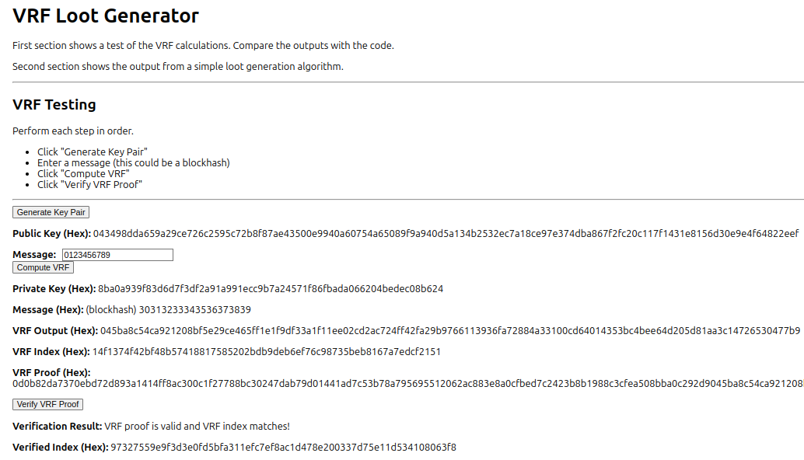
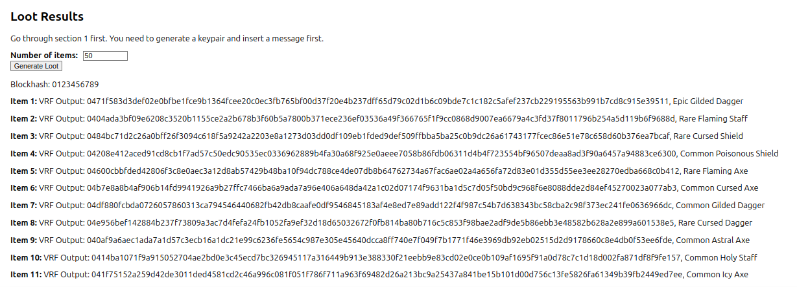

# VRF-based Loot Generation

Private and verifiably random loot generation.

This project is a proof-of-concept for generating randomized loot using Verifiable Random Functions (VRFs). Generation can be done privately on a player's computer.


## Description
Loot is derived deterministically from the VRF Output which may be kept private. This means that the loot generated is also private until revealed by the player. Due to the nature of VRFs it is possible to trust computation done by players as the correctness can be proven cryptographically using publicly-shared values.

The current version of the code generates loot with 3 properties item rarity, type, and enchantment. Example loot: **Epic Flaming Sword**.

This VRF code is based upon the VRF library found in Google's Key Transparency GitHub repository. The translation from Go to JS was performed by ChatGPT. For more details on how the VRF works and why it's used, check out the [VRF Explanation](./VRF.md).


### Features
- **VRF-Based Randomness**: Uses Verifiable Random Functions to generate truly random and verifiable loot.
- **Item Rarity**: Items are classified as Common, Rare, Epic, or Legendary, with customizable probabilities.
- **Item Types**: Loot items include various types like swords, axes, shields, etc.
- **Item Modifiers**: Random modifiers like "Flaming", "Icy", or "Enchanted" are applied to items to increase variety.


## Installation

1. Clone the repository:

```bash
 git clone https://github.com/EdwardAThomson/vrf-loot-generator.git
 cd vrf-loot-generator
```

2. Install dependencies:

```bash
 npm install
```


3. Run the app:

```bash
 npm start
```

This will start the app at http://localhost:3000.


## Usage
After starting the app, navigate to http://localhost:3000 in your browser. You can see the app has 2 sections. The steps in the first section must be performed before the steps in the second section.

### Section 1: VRF Testing
This section written as a way to test the VRF library. It shows a keypair followed by the calculation of the VRF. Finally, there is a calculation for verifying the VRF Proof. This last calculation confirms the values shared publicly are consistent with the calculation performed using private values.

Perform each step in order:

- Click **Generate Key Pair**
- Enter a message (this could be a blockhash).
- Click **Compute VRF**
- Click **Verify VRF Proof**





### Section 2: Loot Generation
Please go through the steps for section 1 first. You need to generate a keypair and insert a message (could be a blockhash).

- Enter the number of items you wish to generate.
- Click **Generate Loot**





## Project Structure

- `src/App.js`: The main React component where loot generation logic is handled.
- `src/vrf.js`: The VRF implementation and core functions to generate and verify VRF outputs.
- `public/index.html`: The entry point for the app.
- `package.json`: Project dependencies and scripts.


## License
This project is licensed under the MIT License - see the [LICENSE](LICENSE) file for details.  (Apache like Google???)


## Acknowledgements
- [React Documentation](https://reactjs.org/docs/getting-started.html)
- [Bootstrap](https://getbootstrap.com/)
- Special thanks to [contributor] for their help with [specific feature].


