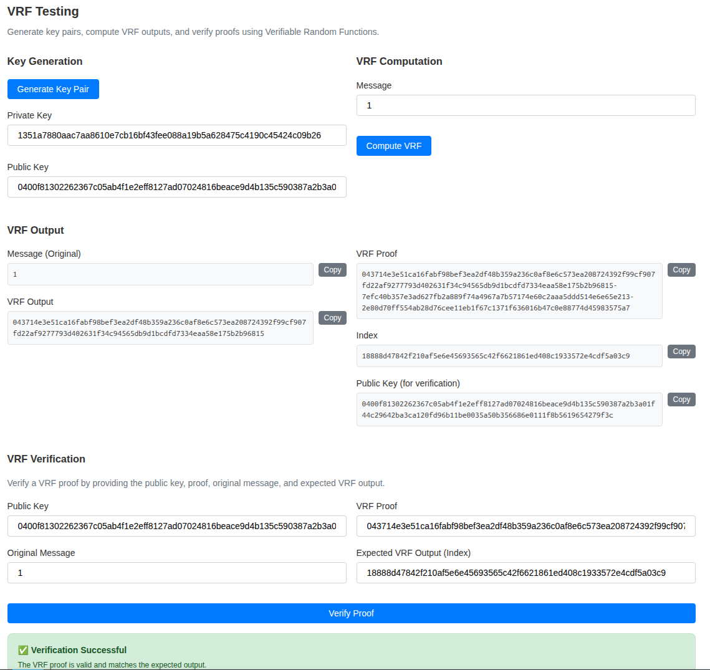
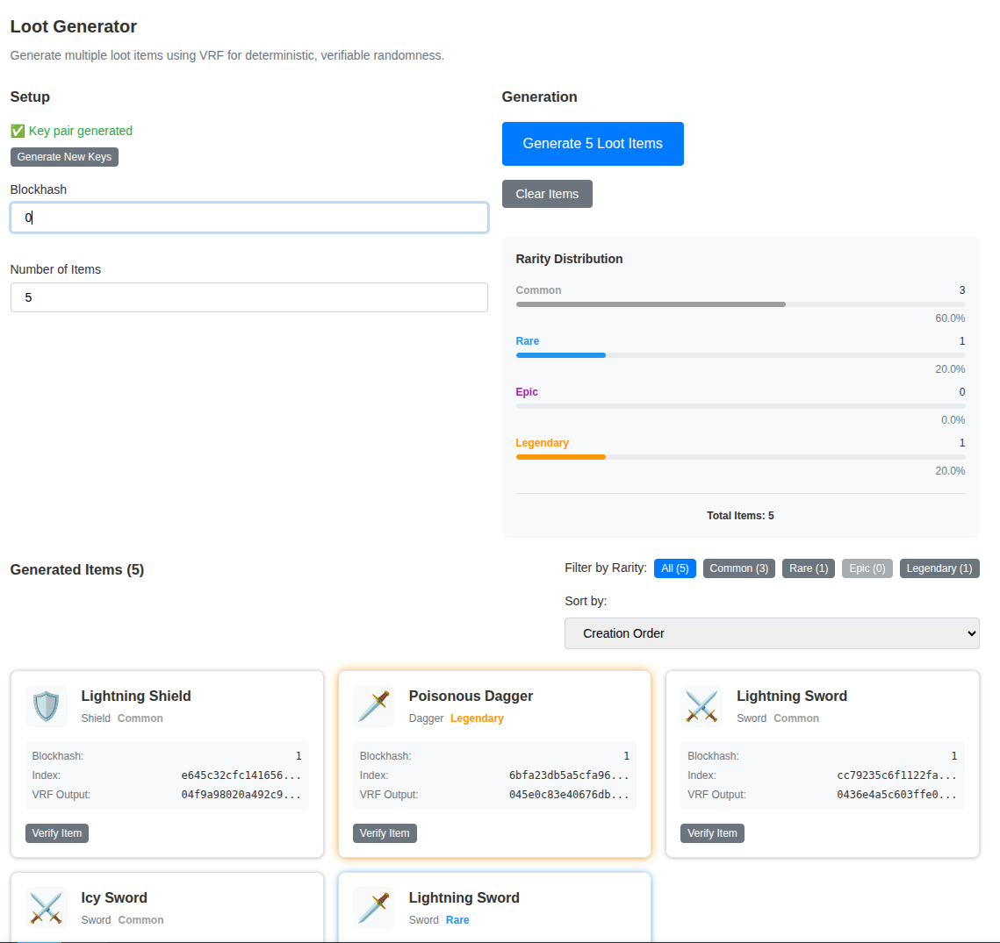

# VRF Loot Generator & Trading System

A React-based application demonstrating private and verifiably random loot generation using Verifiable Random Functions (VRFs), now with an online trading system powered by WebSockets.

## Description

This project showcases how to generate randomized loot (e.g., **Epic Flaming Sword**) using VRFs, ensuring that the process is both private and cryptographically verifiable. Players can generate loot on their own machines, and the results can be trusted by others without revealing the private inputs.

The application has been refactored into a modern, clean architecture using **React**, **TypeScript**, and a **Node.js** backend with **WebSockets** for real-time communication. This enables a new online trading feature where players can securely trade items.

For more details on how the VRF works and why it's used, check out the [VRF Explanation](./VRF.md).

The VRF code in this project is based upon the VRF library found in Google's Key Transparency GitHub repository. The translation from Go to JS was performed by ChatGPT.

## Features

- **VRF-Based Randomness**: Uses Verifiable Random Functions for truly random and verifiable loot generation.
- **Complex Loot Items**: Generates items with multiple properties like rarity (Common, Rare, Epic, Legendary), type (Sword, Axe, Shield), and modifiers (Flaming, Icy).
- **Online Trading System**: A real-time, secure trading system for players to exchange items using a WebSocket server.
- **Clean Architecture**: Separates concerns with a React/TypeScript frontend, custom hooks for logic, Zustand for state management, and a dedicated backend server.
- **Component-Based UI**: Built with reusable React components and styled with CSS Modules.
- **Cryptographically Secure Trade Protocol**: Implements a Commit-Reveal scheme to prevent trade tampering and front-running.
- **Deterministic Educational Demo**: a visual guide to the cryptographic steps involved in a secure trade.

## Installation

The project is divided into a frontend client and a backend server. You'll need to run both.

### 1. Clone the Repository

```bash
 git clone https://github.com/EdwardAThomson/vrf-loot-generator.git
 cd vrf-loot-generator
```

### 2. Setup the Frontend

```bash
# Install dependencies
 npm install

# Run the React app
npm start
```

The client will be running at `http://localhost:3000`.

### 3. Setup the Backend

Open a new terminal window.

```bash
# Navigate to the server directory
cd server

# Install server dependencies
npm install

# Run the WebSocket server
npm run dev
```

The server will be running on port `3001`.

## Usage

After starting both the client and server, open `http://localhost:3000` in your browser. The application is divided into three main sections:

1.  **VRF Testing**: Test the core VRF functionality by generating key pairs, computing VRF outputs, and verifying proofs.
2.  **Loot Generation**: Generate a specified number of loot items using the VRF.
3.  **Online Trading Demo**: Join a trading room and securely trade items with another player in real-time.




## Project Structure

- `server/`: The backend WebSocket server built with Node.js and TypeScript.
  - `src/controllers/`: Handles incoming WebSocket messages.
  - `src/services/`: Core logic for managing players and trading rooms.
- `src/`: The frontend React application.
  - `components/`: Reusable React components, divided into features, layout, and UI.
  - `hooks/`: Custom hooks that contain the majority of the business logic (e.g., `useLootGeneration`, `useOnlineTrading`).
  - `services/`: Client-side services for interacting with the VRF and WebSocket server.
  - `store/`: Zustand store for global state management.
  - `types/`: Shared TypeScript type definitions.
- `public/`: Static assets for the React app.

## License

This project is licensed under the Apache 2.0 License - see the [LICENSE](LICENSE) file for details.

## Acknowledgements

- ChatGPT (original version!)
- Coding assistance also from Claude and Gemini
- Everyone at the Decentralized Gaming Association [DGA Discord](https://discord.com/invite/eZEVrSd)
